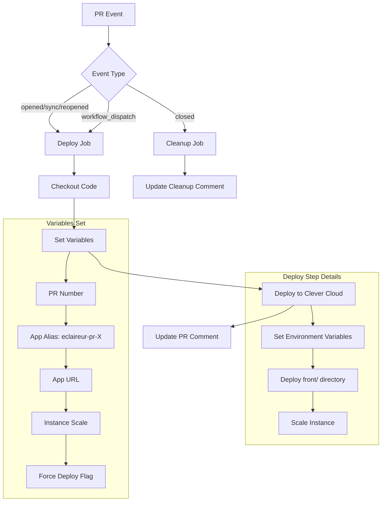

# Eclaireur Public - Clever Cloud R

This repository contains the automated deployment workflows for the Eclaireur Public project using Clever Cloud.

## PR Deployment Workflow

The PR deployment workflow automatically creates preview deployments for pull requests, allowing you to test changes before merging to main.

### Workflow Overview



### Features

- **Automatic PR Deployments**: Every PR creates a unique preview environment
- **Manual Trigger**: Deploy specific PRs using workflow dispatch
- **Configurable Scaling**: Choose instance size (XS, S, M, L, XL, XXL)
- **Force Deployment**: Override Git fast-forward restrictions
- **Auto Cleanup**: Updates PR comments when PRs are closed
- **Environment Variables**: Automatically configures all required secrets

### Deployment URL Pattern

Each PR deployment is accessible at:
```
https://eclaireur-pr-{PR_NUMBER}.cleverapps.io
```

### Required Secrets

The workflow requires these GitHub secrets to be configured:

#### Clever Cloud Authentication
- `CLEVER_TOKEN`: Your Clever Cloud API token
- `CLEVER_SECRET`: Your Clever Cloud API secret

#### Clever Cloud Configuration
- `ORGA_ID`: Your Clever Cloud organization ID
- `CC_CACHE_DEPENDENCIES`: Cache dependencies setting
- `CC_CGI_IMPLEMENTATION`: CGI implementation type
- `CC_NODE_DEV_DEPENDENCIES`: Install dev dependencies flag
- `CC_WEBROOT`: Web root directory
- `HOST`: Application host
- `NODE_ENV`: Node environment (production/development)
- `PORT`: Application port

#### Database Configuration
- `POSTGRESQL_ADDON_HOST`: PostgreSQL host
- `POSTGRESQL_ADDON_DB`: Database name
- `POSTGRESQL_ADDON_USER`: Database user
- `POSTGRESQL_ADDON_PORT`: Database port
- `POSTGRESQL_ADDON_PASSWORD`: Database password
- `POSTGRESQL_ADDON_URI`: Complete database URI

### Manual Deployment

You can manually trigger a deployment using the GitHub Actions UI:

1. Go to the Actions tab
2. Select "PR Future Deployment"
3. Click "Run workflow"
4. Specify:
   - PR number to deploy
   - Instance scale (default: XS)
   - Force deployment (if needed)

### Instance Scaling

The workflow supports different instance sizes with automatic memory allocation:

| Scale | Memory Limit |
|-------|--------------|
| XS    | 1024 MB     |
| S     | 2048 MB     |
| M     | 4096 MB     |
| L+    | 8192 MB     |

### Architecture

The deployment workflow:

1. **Triggers** on PR events or manual dispatch
2. **Deploys** only the `front/` directory to Clever Cloud
3. **Creates** unique app instances per PR (`eclaireur-pr-{number}`)
4. **Configures** environment variables and scaling
5. **Updates** PR comments with deployment status and URL
6. **Cleans up** comments when PRs are closed

### Technologies Used

- **GitHub Actions**: CI/CD automation
- **Clever Cloud**: Application hosting platform
- **47ng/actions-clever-cloud**: Official Clever Cloud deployment action
- **Node.js/Yarn**: Frontend build system

### Development

To modify the deployment workflow, edit `.github/workflows/pr-deploy.yml`. The workflow uses the official Clever Cloud GitHub Action for reliable deployments.